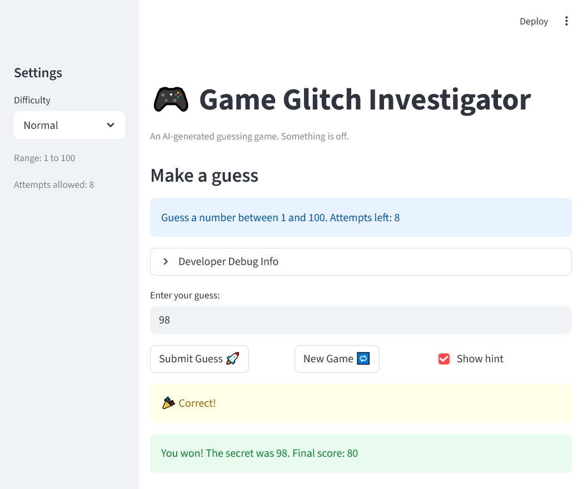
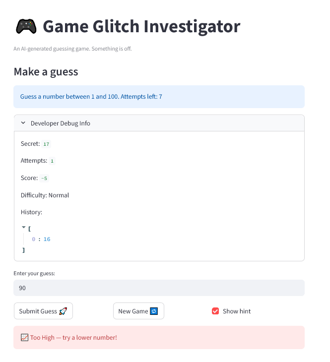
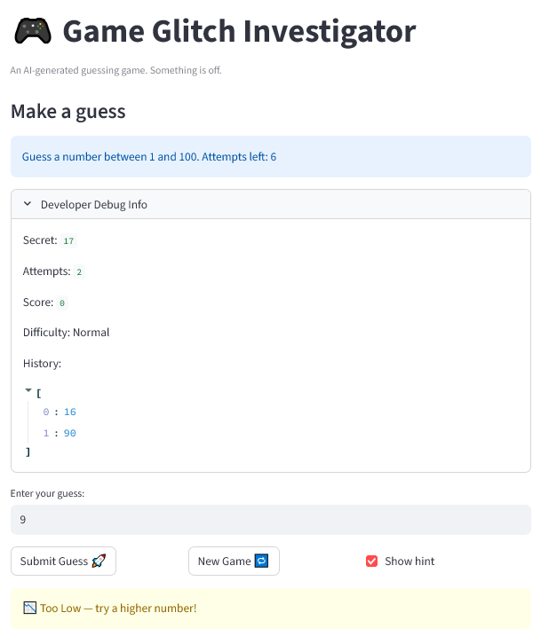

# 🎮 Game Glitch Investigator: The Impossible Guesser (Fixed File)

## 🚨 The Situation

You asked an AI to build a simple "Number Guessing Game" using Streamlit.
It wrote the code, ran away, and now the game is unplayable. 

- You can't win.
- The hints lie to you.
- The secret number seems to have commitment issues.

## 🛠️ Setup

1. Install dependencies: `pip install -r requirements.txt`
2. Run the broken app: `python -m streamlit run app.py`

## 🕵️‍♂️ Your Mission

1. **Play the game.** Open the "Developer Debug Info" tab in the app to see the secret number. Try to win.
2. **Find the State Bug.** Why does the secret number change every time you click "Submit"? Ask ChatGPT: *"How do I keep a variable from resetting in Streamlit when I click a button?"*
3. **Fix the Logic.** The hints ("Higher/Lower") are wrong. Fix them.
4. **Refactor & Test.** - Move the logic into `logic_utils.py`.
   - Run `pytest` in your terminal.
   - Keep fixing until all tests pass!

## 📝 Document Your Experience

-Game Purpose
The game is a simple number-guessing challenge built with Steamlit. The player chooses a range, the app gerenates a secret number, and the player tries to guess it using "Higher/Lower" hints. The goal is to guess correctly in as few attempts as possible.
-Bugs I Found
   1) Reversed Hint Logic:
      The game told me to "Go Higher" when my guess was already too high, and "Go Lower" when my guess was too low. this made the game impossible to win without looking at the debug info.
   2) Secret Number Resetting Every Click
      Steamlit reruns the script on every interaction, so the secret number was being regenerated each time 1 pressed "Submit". This made the game unwinnable because the target number kept changing.
   3) Import Issues during testing
      Pytest couldn't import logic_utils.py until I fixed the project structure nad added a conftest.py to ensure the project root was on the python path. 

- Fixes I applied
   -Corrected the hint logic: inside check_guess() and added a commnet documneting the fix.
   -Stabilized the secret number using st.session_state so it persists scross reruns.
   -separated game logic into logic_utils.py to make it testable.
   -Added and ran pytest tests, confirming that the logic works correctly. All tests passed.
   -Fixed import paths so pytest could properly load the logic module.

## 📸 Demo

## 🚀 Stretch Features

- 
- 
